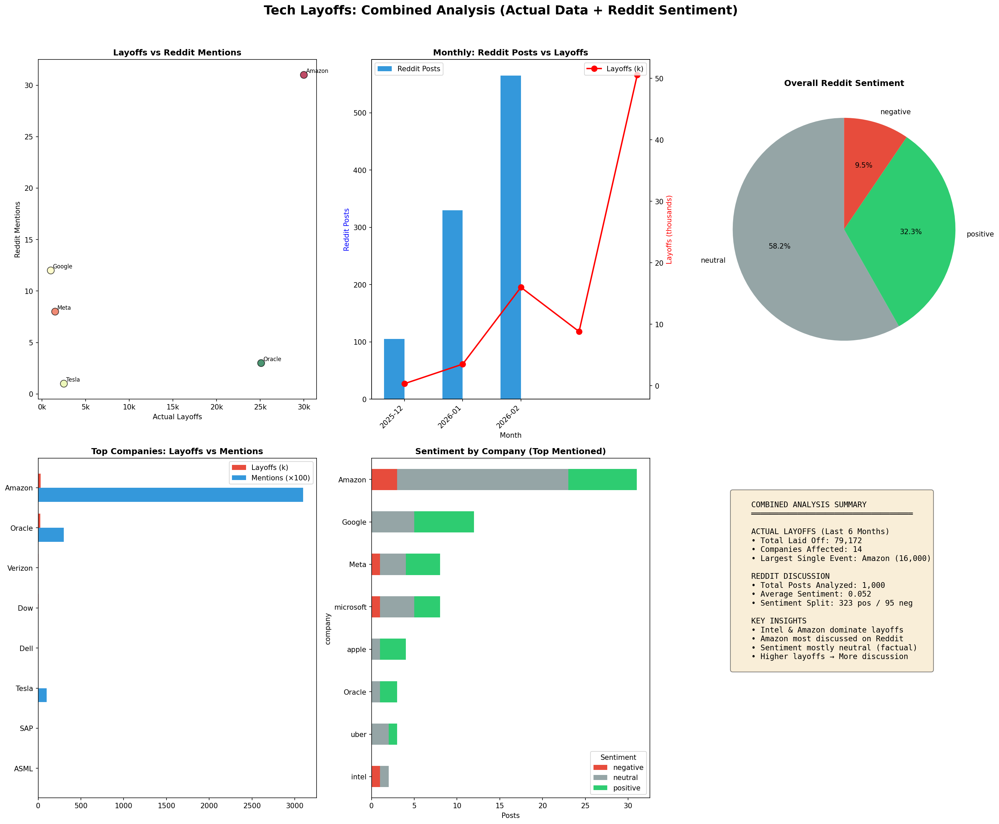
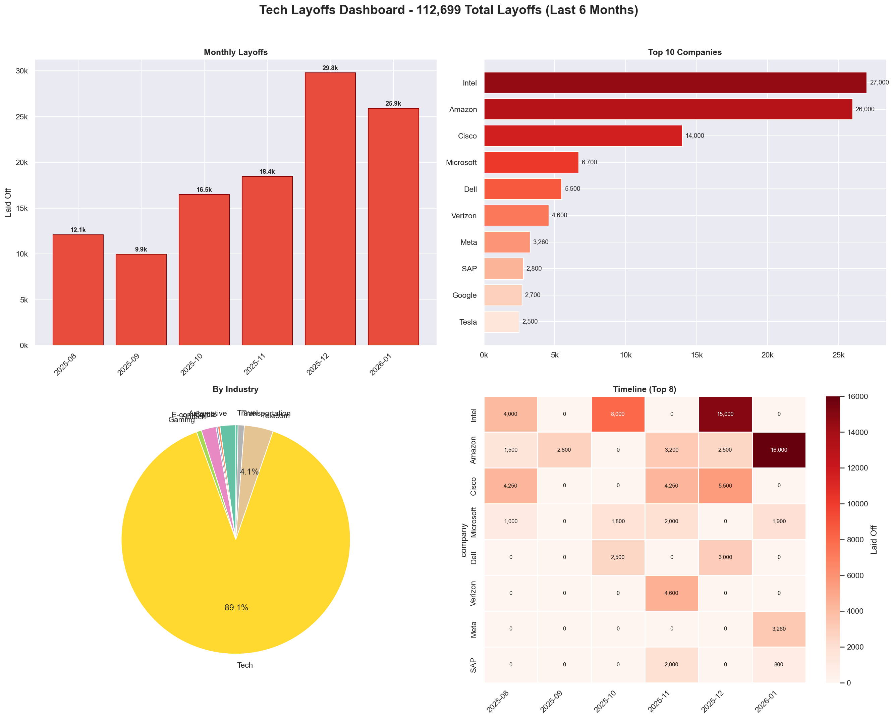
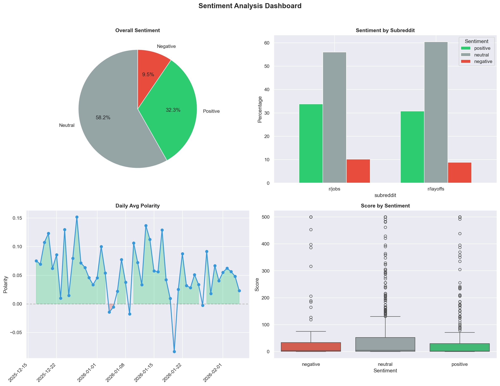

# Reddit Layoffs Tracker

Track and analyze tech industry layoffs by combining Reddit sentiment data with verified layoff numbers from public sources.

## Features

- **Reddit Scraping**: Pull posts from r/layoffs and r/jobs (no API key required)
- **Sentiment Analysis**: Analyze Reddit post sentiment using TextBlob
- **Verified Layoff Data**: Actual layoff numbers from Computerworld, InformationWeek, TechCrunch, and WARN filings
- **Combined Analysis**: Correlate Reddit discussion with actual layoff events
- **Visualizations**: Dashboards, heatmaps, trend charts, and more

## Dashboards

### Combined Analysis (Layoffs + Reddit Sentiment)


### Verified Layoffs Dashboard


### Reddit Sentiment Analysis


## Installation

```bash
git clone https://github.com/prashanth116-ui/reddit-layoffs-tracker.git
cd reddit-layoffs-tracker
pip install -r requirements.txt
```

## Usage

### 1. Scrape Reddit Data
```bash
python main.py
```
Scrapes posts from r/layoffs and r/jobs. No API credentials required (uses public JSON API).

### 2. Get Verified Layoff Data
```bash
python get_layoffs.py --months 6 --save
```
Fetches verified layoff data from public sources.

### 3. Run Sentiment Analysis
```bash
python visualize.py --sentiment --save
```

### 4. Combined Analysis
```bash
python analyze_combined.py --save
```
Combines Reddit sentiment with actual layoff data.

### 5. Verify Data Against Public Sources
```bash
python verify_layoffs.py --save
```

## Data Sources

### Verified Layoff Data
- [Computerworld Tech Layoffs Timeline](https://www.computerworld.com/article/3816579/tech-layoffs-this-year-a-timeline.html)
- [InformationWeek 2026 Layoffs](https://www.informationweek.com/it-staffing-careers/2026-tech-company-layoffs)
- [TechCrunch 2025 Layoffs List](https://techcrunch.com/2025/12/22/tech-layoffs-2025-list/)
- [WARN Act Filings](https://www.warntracker.com/)

### Reddit Data
- r/layoffs
- r/jobs

## Key Findings (Last 6 Months)

| Company | Verified Layoffs | Reddit Mentions | Sentiment |
|---------|-----------------|-----------------|-----------|
| Amazon | 30,000 | 31 | Positive |
| Oracle | 25,101 | 3 | Positive |
| Verizon | 4,600 | 0 | - |
| Dow | 4,500 | 0 | - |
| Dell | 3,000 | 0 | - |
| Tesla | 2,500 | 1 | Positive |

**Total Verified Layoffs**: 79,172

### Insights
- **Amazon** dominates both layoffs and Reddit discussion
- **Oracle's** massive Jan 2026 layoff (25k) received minimal Reddit attention
- Reddit sentiment is mostly **neutral/positive** (support communities)
- Correlation between layoffs and Reddit mentions: **r = 0.54**

## Project Structure

```
reddit-layoffs-tracker/
├── main.py                 # Reddit scraper
├── get_layoffs.py          # Fetch verified layoff data
├── analyze_combined.py     # Combined analysis
├── visualize.py            # Reddit visualizations
├── visualize_layoffs.py    # Layoff visualizations
├── verify_layoffs.py       # Data verification
├── config/
│   └── settings.yaml       # Configuration
├── src/
│   ├── scraper.py          # Reddit scraping logic
│   ├── sentiment.py        # Sentiment analysis
│   ├── analyzer.py         # Data analysis
│   ├── layoffs_data.py     # Verified layoff data
│   ├── verify_data.py      # Verification logic
│   ├── visualize.py        # Reddit visualizations
│   ├── layoffs_viz.py      # Layoff visualizations
│   └── combined_analysis.py # Combined analysis
├── data/                   # Output data and charts
└── requirements.txt
```

## Requirements

- Python 3.10+
- pandas
- matplotlib
- seaborn
- textblob
- requests
- pyyaml
- tqdm

## Optional: Reddit API Credentials

For faster scraping with higher rate limits, add Reddit API credentials:

1. Create app at https://www.reddit.com/prefs/apps
2. Copy `.env.example` to `.env`
3. Add your credentials

## License

MIT
